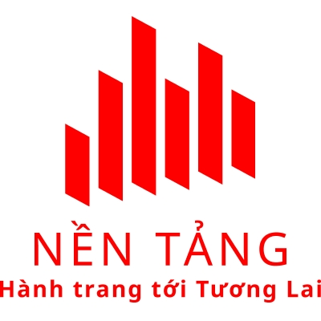

# [https://nentang.vn](https://nentang.vn)

- Các bài học miễn phí về Lập trình
- Học web PHP - Learning PHP - Laravel
- Xem nhiều hơn tại [https://nentang.vn](https://nentang.vn)

# Các chương trình cần thiết để lập trình web
- [Git for window](https://git-scm.com/download/win)
- XAMPP với PHP 7+, MySQL 5.6+ - [XAMPP](https://www.apachefriends.org/download.html)
- Composer - trình quản lý các gói package PHP - [Composer](https://getcomposer.org/download/)
- HeidiSQL - quản lý thực thi câu truy vấn SQL - [HeidiSQL](https://www.heidisql.com/download.php)
- Visual Studio Code IDE - trình gõ code - [Visual Studio Code](https://code.visualstudio.com/)
- TortoiseGIT - [TortoiseGIT](https://tortoisegit.org/download/)
